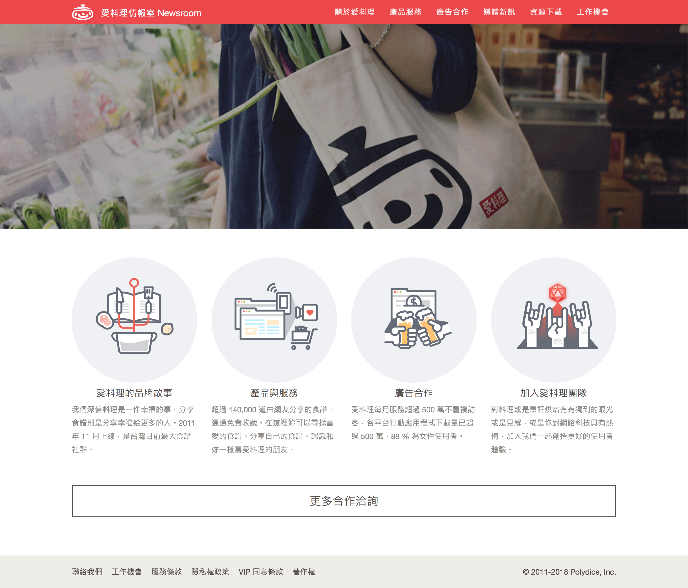

# Overview
An official PR website which is built using Ruby on Rails launched in 2014. 

### Skills
- Ruby on Rails

In this project, I strated to develope backend relative things, and that's how I've learned skills and knowledges about MVC, Ruby, Rails etc.. and I like learning by doing.

You can check the site [here](https://newsroom.icook.tw/).
