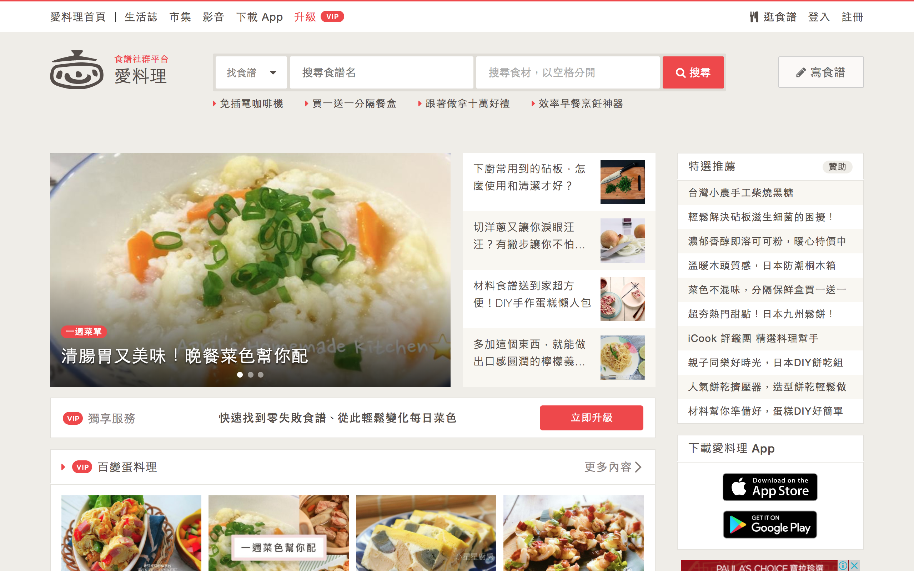

# Overview
iCook is the largest recipe sharing platform in Taiwan. Here I was in the iOS / Ruby on Rails development team, mainly engaged in iCook recipe website (and its related sites).

### Skills
- HTML, CSS, JavaScript

I've been in charge prototyping whole website pages and collaborated with designers and engineers. over 4 years I have engaged in projects are:

* iCook - a recipe sharing platform in Taiwan
* Cupboard - iCook's UI Kit which is a front-end style guide
* Newsroom.icook - iCook's official PR website
* Cafe.icook - a forum platform which has been shut down in middle 2015

You can check [here](https://icook.tw) to see more about iCook.