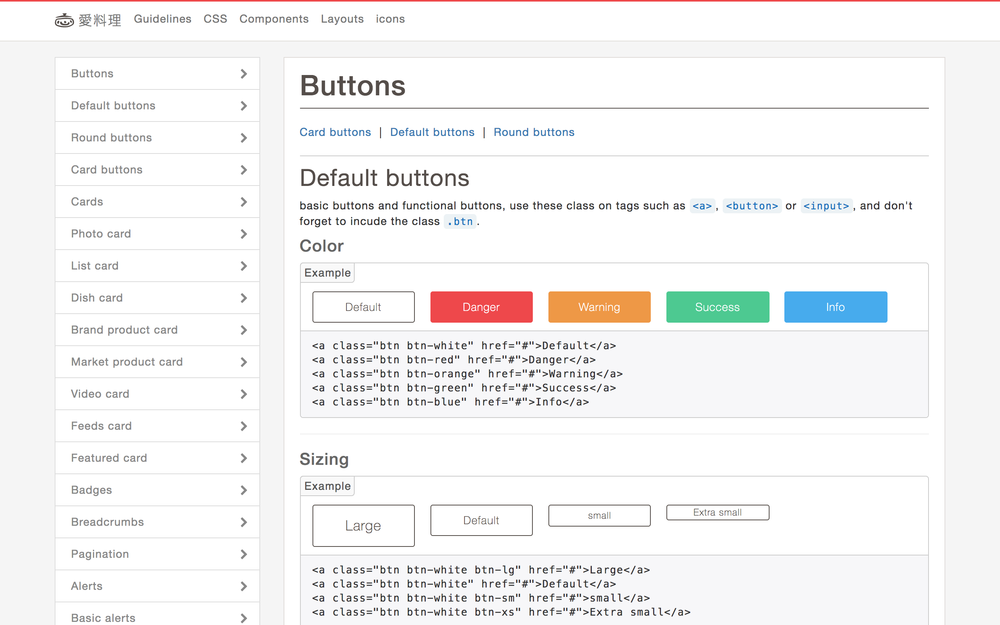

# Overview
Cupboard is a UI Kit, a front-end style guide of iCook. it provides current elements and components of UI design defined by designers for collaborates with front-end development well.

### Skills
- HTML, CSS, Markdown
- Hologram (a Markdown based style guide made by [trulia](https://github.com/trulia/hologram))

You can check the website [here](https://cupboard.polydice.com/)

I also wrote an article share about these tools and skills on [medium](https://icook.engineering/starting-from-scss-lint-to-ui-kit-2d8436e46c45)
