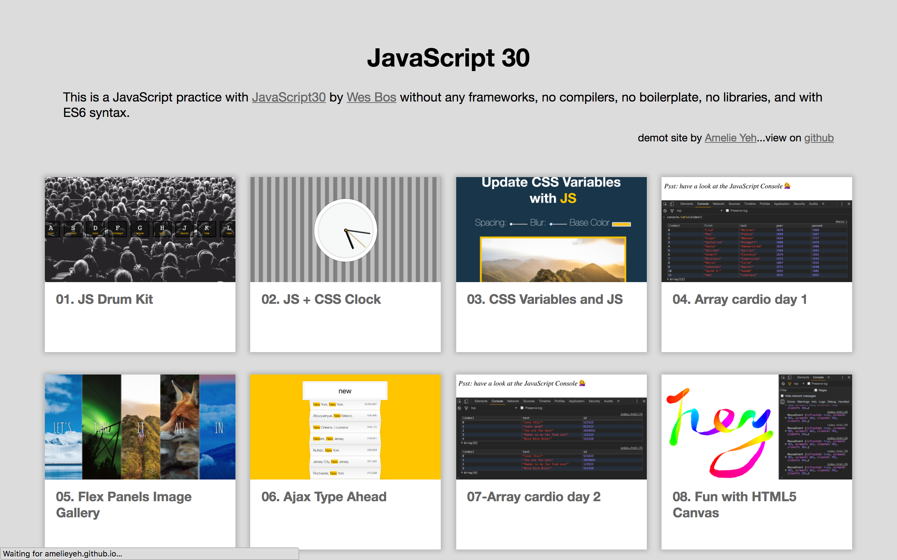

# Overview
This is a JavaScript practice with JavaScript30 by Wes Bos without any frameworks, no  compilers, no boilerplate, and no libraries.

### Skills
- HTML, CSS, JavaScript

In this project, I practice and review a lot of foundamantals of JavaScript, and create many fun stuffs with css.

You can check the Demo Site [here](https://amelieyeh.github.io/JS30/) and my learning notes on my [github](https://github.com/amelieyeh/js30).